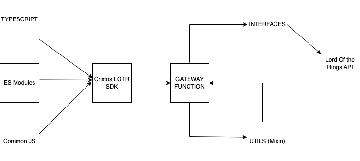

# SDK Design

This SDK is built up by following Domain Driven Architecture approach.

## Elements

### API

As API is a source, in this case the Lord of the Rings [https://the-one-api.dev/v2]

### Interfaces

This layer is simply a domain reflection of the API which contains abstractions of various API requests.

### Utils

This contains general purposed utility function using which we can reuse the existing block of code

For our case we only have Mixin which is faux-multiple inheritance pattern for classes in JavaScript which TypeScript has support for. The pattern allows you to create a class which is a merge of many classes. To get started, we need a type which we'll use to extend other classes from. The main responsibility is to declare that the type being passed in is a class.

### Gateway function

In the head of all is a gateway function. Simple closure, that returns a banch of methods, providing access to different useCases methods. It's responsible for inititalizing function of context, that are used under different architecture levels.

### Cache

For further versions it will be nice to add caching so as to reduce the dependecy on the base API and also improve SDK response time

## SDK Flow

Here is a visual reproduction of SDK flow

